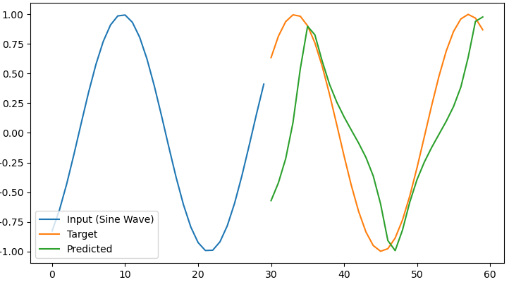
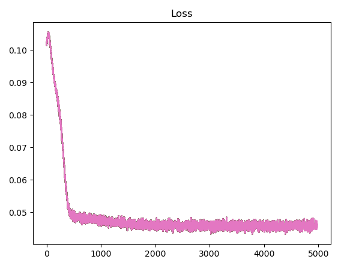

# RNN Numpy

Pure NumPy implementation of a vanilla RNN (+ training) built for educational purposes.
It implements a RNN module (its forward and backward (including truncated and non-truncated backpropagation through time) passes). The loops implement the
specifics for training the model.

This was built for educational purposes, so I did not spend much time tuning the different hyperparameters/training methodology or optimizing the code.

## Experiments

Two experiments were carried out:

1. **Classifying names by nationality**: A character-level RNN was trained to classify names by their nationality. To run it, download
   download the data from https://download.pytorch.org/tutorial/data.zip and put it in the ./data/names folder. Then, execute the following command:

```bash
python names.py
```

Additionally, use the argument `--single` to use a single-layer RNN. Otherwise, a two-layer RNN will be used.

2. **Continuing a sine wave**: A simple RNN was trained to predict the next values of a sine wave. To run it, execute the following command:

```bash
python sine.py
```

The model is able to kind of learn the sine wave (altough the methodology used to interpret the input/outputs is not the best). Additionally,
truncated backpropagation through time was used to train the model.



For the names, the model achieves a decent top-3 performance (given that name nationalities can sometimes be ambiguous even for humans,
it's better to judge the model by its top-k performance rather than its accuracy).

## License

This project is licensed under the MIT License - see the [LICENSE](LICENSE) file for details.
